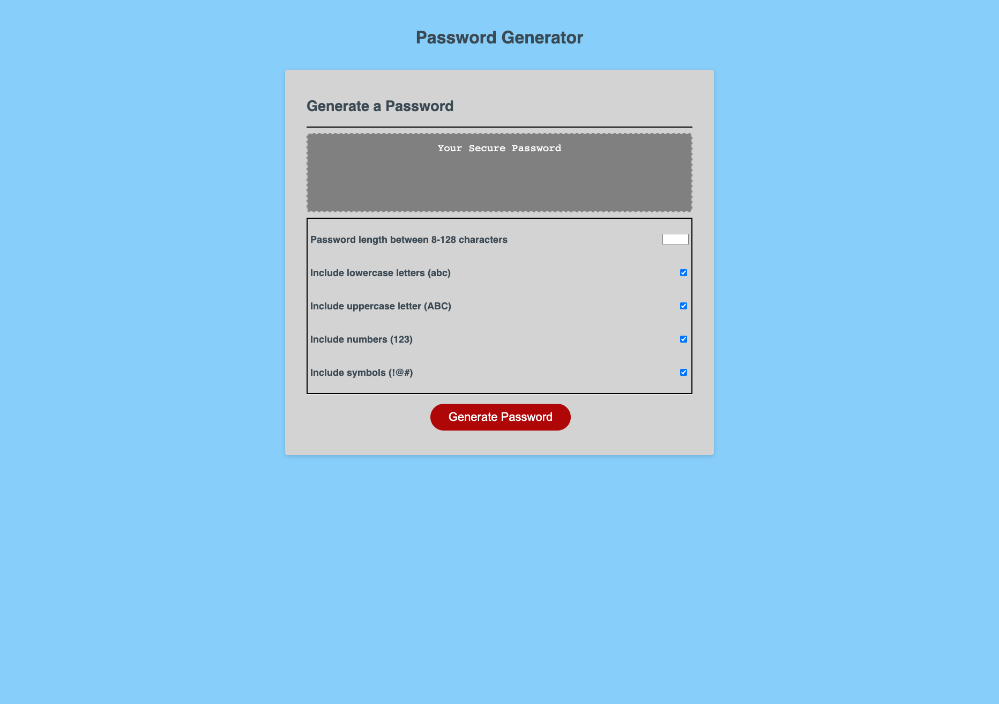

# Password Generator using Javascript
## Description 
The purpose of this page is to generate the password with options:
- Input the number of length characters between 8 - 128.

- Select if you want lowercase to add your password.

- Select if you want uppercase to add your password.

- Select if you want numeric to add your password. 

- Select if you want symbols/special character to add your password.

- It will display the password you choose in textarea after click the "Generate Password" button.

## Screenshot

## Github Page Link
Click [here](https://jlara65.github.io/password-generator/) to generate your password.